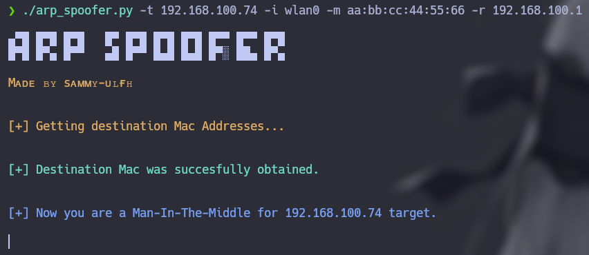

# arp_spoofer

<p align="center">
    
</p>

**Arp Spoofer** is a tool that tricks your router and target device into sending all their traffic to you. You can use it by providing **target host**, **router gateway**, **network interface name** and **your current MAC address**.

<p align="center">
    
</p>

## Table of contents

- [First stepts](#what-do-i-need-to-run-it)
- [Neccesarry steps before running](#how-does-it-work)
- [How to run it](#how-do-i-use-it)

## What do I need to run it?

1. First, clone the repository:

    ```git
    git clone https://github.com/sammy-ulfh/arp_spoofer.git
    ```

2. Then, navigate to the **arp_spoofer/script** directory.

3. Next, install required libraries using pip:

    ```pip3
    pip3 install -r requirements.txt
    ```

## How does it work?

This **ARP Spoofer** tool tricks your router and target device into sending all their traffic to you by sending a packet that changes the real MAC addres of each device to yours.

Usually, a PC is not ready to redirect all the traffic, so you need to change some rules.

- Then, add several rules to **iptables**:

    - To receive the traffic:<br/>
        ```shell
        iptables --policy FORWARD ACCEPT
        ```

    - To maintain the internet connection of the target:<br/>
        ```shell
        iptables -t nat -A POSTROUTING -o [INTERFACE] -j MASQUERADE
        iptables -A FORWARD -i [INTERFACE] -j ACCEPT
        ```

## How do I use it?

**NOTE:** Root privileges are required.

- **Target:**
    Provide a target IP using the **-t / --target** argument.<br/>
    Example: -t 192.168.0.12

- **Router:**
    Provide the router gateway IP using the **-r / --router** argument.<br/>
    Example: -r 192.168.0.1

- **Interface:**
    Provice the Network Interface Name using the **-i / --interface** argument.<br/>
    Example: -i wlan0

- **Mac:**
    Provide your current MAC address using the **-m / --mac** argument.<br/>
    Example: -m aa:bb:cc:44:55:66

Great! Now you can intercept all the traffic using a tool like **Wireshark**.
